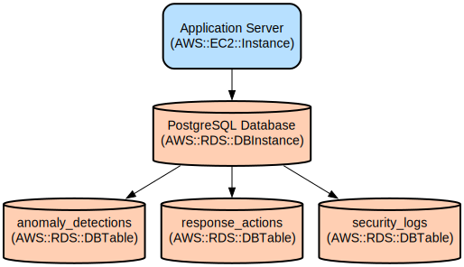

# AI-Powered Security Analysis System with Real-Time Threat Detection

The Security Analysis System is a comprehensive security monitoring solution that combines AI-powered log analysis, anomaly detection, and automated response capabilities to protect your infrastructure in real-time.

This system integrates multiple security tools and provides a modern web interface for security operations teams. It processes security logs from various sources (Zeek, Suricata, OSQuery), uses machine learning to detect anomalies, and enables automated responses to security threats. The system features real-time monitoring, AI-powered analysis using GPT-4 and Mistral models, and a responsive React-based dashboard for threat visualization and management.

Key features include:
- Real-time log ingestion and analysis from multiple security tools
- AI-powered anomaly detection using Isolation Forest algorithm
- Automated threat response capabilities
- Interactive security dashboard with live monitoring
- RESTful API for integration with existing security tools
- Persistent storage with SQLite database and migration support

## Repository Structure
```
.
├── system/                     # Backend Python application
│   ├── main.py                # FastAPI application entry point
│   ├── database.py            # Database models and connection management
│   ├── anomaly_detection.py   # ML-based anomaly detection implementation
│   ├── log_parsers.py         # Log parsing and validation logic
│   ├── alembic/               # Database migration scripts and configuration
│   └── routers/               # API route handlers
├── user/                      # Frontend React application
│   ├── src/                   # React source code
│   │   ├── components/        # React components for dashboard
│   │   └── api/              # API integration layer
│   └── public/               # Static assets
└── deployments/              # Deployment configurations and Docker setup
```

## Usage Instructions
### Prerequisites
- Python 3.11 or higher
- Node.js 16.x or higher
- PostgreSQL 13+ or SQLite 3
- Docker (optional)

Required Python packages:
```
fastapi>=0.68.0
uvicorn>=0.15.0
sqlalchemy>=1.4.0
alembic>=1.7.0
python-multipart>=0.0.5
pydantic>=1.8.0
```

Required Node.js packages:
```
react>=18.0.0
typescript>=4.0.0
tailwindcss>=3.0.0
```

### Installation

#### Backend Setup
```bash
# Clone the repository
git clone <repository-url>
cd security-analysis-system

# Create and activate virtual environment
python -m venv venv
source venv/bin/activate  # On Windows: .\venv\Scripts\activate

# Install backend dependencies
cd system
pip install -r requirements.txt

# Initialize database and run migrations
python -m alembic upgrade head
```

#### Frontend Setup
```bash
# Install frontend dependencies
cd ../user
npm install

# Build frontend assets
npm run build
```

### Quick Start
1. Start the backend server:
```bash
cd system
uvicorn main:app --reload --host 0.0.0.0 --port 8000
```

2. Start the frontend development server:
```bash
cd user
npm run dev
```

3. Access the dashboard at http://localhost:5173

### More Detailed Examples

#### Ingesting Security Logs
```python
import requests
import json

log_data = {
    "source_ip": "192.168.1.100",
    "content": {
        "timestamp": "2024-03-14T12:00:00Z",
        "event_type": "connection",
        "protocol": "TCP"
    }
}

response = requests.post(
    "http://localhost:8000/api/ingest",
    json=log_data
)
print(response.json())
```

#### Training Anomaly Detection Model
```python
import requests

training_data = {
    "source_ip": "192.168.1.100",
    "window_minutes": 60,
    "logs": ["log1", "log2"]
}

response = requests.post(
    "http://localhost:8000/api/train_model",
    json=training_data
)
print(response.json())
```

### Troubleshooting

#### Common Issues

1. Database Connection Issues
```bash
# Check database status
python -c "from system.database import init_db; init_db()"

# Verify database file exists
ls system/data/security.db
```

2. Migration Errors
```bash
# Reset migrations
cd system
alembic downgrade base
alembic upgrade head
```

3. Model Training Issues
- Enable debug logging in `system/anomaly_detection.py`
- Check model files in `system/models/` directory
- Verify training data format

#### Debug Mode
Enable debug logging:
```python
# In system/main.py
logging.basicConfig(level=logging.DEBUG)
```

Log files location: `system/logs/`

## Data Flow
The system processes security data through a pipeline of ingestion, analysis, and response. Logs are collected from security tools, processed through AI models for analysis, and anomalies trigger automated responses.

```ascii
[Security Tools] -> [Log Ingestion] -> [AI Analysis] -> [Anomaly Detection]
                                                              |
[Response Actions] <- [Alert Generation] <- [Threat Detection] |
```

Component interactions:
1. Log Ingestion validates and stores incoming security logs
2. Feature Extraction processes logs for AI analysis
3. Anomaly Detection identifies suspicious patterns
4. Threat Detection evaluates anomalies for severity
5. Alert Generation creates notifications for security teams
6. Response Actions execute automated security measures

## Infrastructure


- Database: SQLite database with Alembic migrations
  - Tables: security_logs, anomaly_detections, response_actions
  - Indexes on source_ip and timestamp columns

- Docker Container:
  - Base: python:3.11-slim
  - Exposed Port: 8000
  - Volume Mounts: /app/models, /app/data

## Deployment
1. Build Docker image:
```bash
docker build -t security-analysis-system -f deployments/Dockerfile .
```

2. Run container:
```bash
docker run -p 8000:8000 -v $(pwd)/data:/app/data security-analysis-system
```

3. Environment Variables:
```bash
SQLALCHEMY_DATABASE_URL=sqlite:///./data/security.db
LOG_LEVEL=INFO
CORS_ORIGINS=http://localhost:5173
```